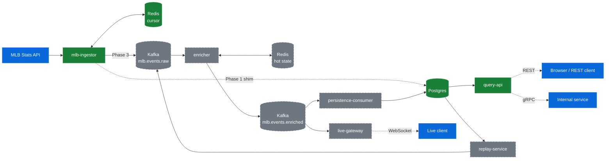

# live-sports-platform

A distributed event-driven platform that ingests live MLB events, enriches them with game state, stores them durably, replays historical games, and serves downstream consumers through typed internal services and real-time external interfaces.

**Current phase:** ✅ Phase 1 (Foundation) · 🔄 Phase 2 (Live end-to-end) · ⏳ Phases 3–7

Canonical design: [sports-platform-prd.md](sports-platform-prd.md)

## Architecture



Green = built. Dashed gray = planned. Blue = external boundary. In Phase 1 the ingestor writes directly to Postgres; that shim gets removed in Phase 3 when Kafka and `persistence-consumer` land.

## What's built right now (Phase 1)

- **`mlb-ingestor`** — polls MLB Stats API per active game, diffs state, derives deterministic `event_id`, stamps the three-timestamp spine, persists per-game cursor to Redis
- **`query-api`** — FastAPI REST over recent pitches from Postgres
- **schemas** — Pydantic models + event ID derivation rules + schema evolution doc (protobuf becomes canonical in Phase 3)
- **common** — structured JSON logging with correlation IDs, Prometheus `/metrics`, Sentry hooks, config loader
- **migrations** — initial event log schema with the required unique + composite indexes
- **tests** — event ID, parser, cursor unit tests
- **local infra** — `docker-compose.yml` for Postgres + Redis

## Quick start

Requires Python 3.12+, Docker, and [uv](https://github.com/astral-sh/uv).

```bash
# 1. Copy env (gitignored) and adjust if needed — defaults match docker-compose
cp .env.example .env.local

# 2. Start Postgres + Redis
docker compose up -d

# 3. Install Python deps
uv venv
source .venv/bin/activate
uv pip install -e ".[dev]"

# 4. Apply migrations
psql $DATABASE_URL -f migrations/001_initial.sql

# 5. Run the ingestor (terminal 1)
python -m services.mlb_ingestor

# 6. Run the query API (terminal 2)
python -m services.query_api

# 7. Hit it (needs a live MLB game in progress)
curl http://localhost:8080/games/latest
```

Run tests with `pytest`.

## Repo layout

```
schemas/            Pydantic models + event ID derivation (single source of truth until Phase 3)
services/
  common/           Shared logging, metrics, Sentry, config
  mlb_ingestor/     MLB Stats API ingestor
  query_api/        FastAPI REST API
migrations/         SQL migrations
tests/              Unit and integration tests
docker-compose.yml  Local Postgres + Redis
sports-platform-prd.md  Canonical design doc
```

## Tech stack

| Layer | Choice | Why |
|---|---|---|
| Language | Python 3.12 | Fast iteration, mature async + data libs |
| Message bus | Kafka | Partition by `game_pk` for per-game ordering; durable decoupling |
| Schema | Protobuf (Phase 3+) | Real schema-evolution story, cheap internal gRPC |
| Durable store | PostgreSQL | Event log + replay source of truth |
| Hot state | Redis | Narrowly scoped: ingestor cursor + enricher hot state |
| Internal RPC | gRPC | Typed service-to-service boundaries |
| External read | REST | Simple, demoable, browser-friendly |
| External push | WebSocket | Live fanout from enriched events |
| Container / deploy | Docker + Kubernetes on DOKS | Real cloud deployment, not minikube theater |
| Metrics + dashboards | Prometheus + Grafana | Self-hosted observability story |
| Tracing | OpenTelemetry + Jaeger | Hot-path tracing, vendor-neutral |
| CI | GitHub Actions | Standard, free for public repos |

## Performance definitions

All latency claims use these exact definitions:

- **Upstream** = `source_time − event_time`
- **Platform pipeline** = `enriched_publish_time − ingest_time`
- **Platform serving** = `served_time − ingest_time` *(headline metric)*
- **End-to-end** = `client_receive_time − event_time`

Every benchmark report will include p50/p95/p99, throughput, workload definition, event source, and hardware config. See `docs/BENCHMARKS.md` (Phase 6).

## Roadmap

| Phase | Scope | Status |
|---|---|---|
| 1 | Schemas, event IDs, local PG+Redis, ingestor + query API scaffold, unit tests, structured logs, Prometheus metrics | ✅ Complete |
| 2 | Prove live MLB ingestion end-to-end, cursor recovery against real infra, first live demo capture | 🔄 In progress |
| 3 | Kafka split, protobuf as canonical schema, `persistence-consumer`, per-game ordering, DLQ handling | ⏳ Planned |
| 4 | `enricher` + `replay-service`, replay must be consumer-compatible with live flow | ⏳ Planned |
| 5 | Kubernetes deployment on DOKS, managed Postgres + Redis, health/readiness probes, CI pipelines | ⏳ Planned |
| 6 | Grafana dashboards, hot-path OTel tracing, benchmark harness, targeted failure-injection writeup | ⏳ Planned |
| 7 | `docs/DESIGN.md`, architecture diagram polish, screenshots, final benchmark numbers | ⏳ Planned |

## Non-goals (v1)

- NFL or multi-sport support
- Betting execution or broker integration
- Public multi-tenant productization
- ClickHouse / warehouse analytics
- Terraform, service mesh, multi-region deployment
- Full chaos-engineering platform (targeted failure scenarios only)

## License

TBD.
